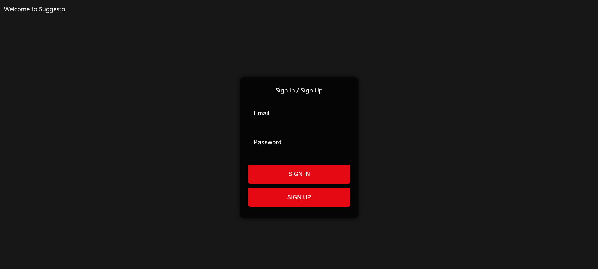
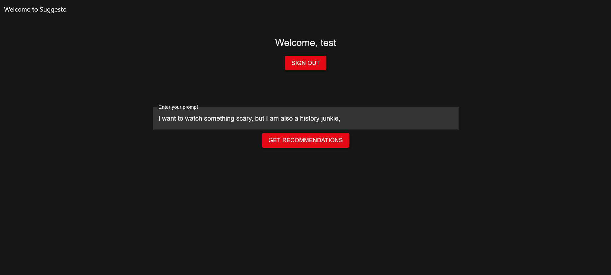

# Suggesto

Suggesto is an AI-powered movie recommendation web application that provides personalized movie suggestions based on user prompts. Whether you're looking for something to watch on a rainy day or in the mood for a specific genre, Suggesto delivers tailored recommendations using OpenAI's GPT-3.5 and the TMDb API.

## Table of Contents

- [Features](#features)
- [Technologies Used](#technologies-used)
- [Setup and Installation](#setup-and-installation)
  - [Prerequisites](#prerequisites)
  - [Installation](#installation)
- [How to Use](#how-to-use)
- [Screenshots](#screenshots)
- [Video Demo](#video-demo)
- [Future Enhancements](#future-enhancements)
- [Contributing](#contributing)
- [License](#license)

## Features

- **Personalized Recommendations:** Enter a prompt, and Suggesto will suggest a movie tailored to your preferences.
- **TMDb Integration:** Get detailed information about the recommended movie, including the poster, overview, and rating.
- **Rating System:** Rate the recommended movie and save your rating to the watch history.
- **Watch History:** Save recommended movies to your watch history.
- **Another Option:** Not satisfied with the recommendation? Click "Another Option" to get a different movie suggestion.
- **Responsive Design:** The app is designed to be responsive and works well on various screen sizes.

## Technologies Used

- **React:** Frontend library for building the user interface.
- **Firebase:** Backend service for authentication, Firestore for user data and watch history.
- **OpenAI GPT-3.5:** AI model used for generating movie recommendations based on user prompts.
- **TMDb API:** Provides movie details such as title, overview, poster, and ratings.
- **Material-UI (MUI):** Used for styling and UI components.
- **Express.js:** Backend server to handle API requests.
- **Node.js:** JavaScript runtime for server-side scripting.

## Setup and Installation

### Prerequisites

- Node.js (v14+)
- npm or yarn
- Firebase account and project
- TMDb API Key
- OpenAI API Key

### Installation

1. Clone the repository:

    ```bash
    git clone https://github.com/fernan17893/Suggesto
    ```

2. Navigate to the project directory:

    ```bash
    cd suggesto
    ```

3. Install dependencies for both the frontend and backend:

    ```bash
    npm install
    ```

4. Set up Firebase in your project:
    - Create a Firebase project and add your Firebase config to `firebase-config.js`.
    - Set up Firestore and Authentication in the Firebase console.

5. Set up environment variables:
    - Create a `.env` file in the root directory and add your TMDb and OpenAI API keys:

    ```makefile
    TMDB_API_KEY=your_tmdb_api_key
    OPENAI_API_KEY=your_openai_api_key
    ```

6. Start the development server:

    ```bash
    npm run dev
    ```

## How to Use

1. Enter a movie-related prompt in the input field (e.g., "Suggest a horror movie for a rainy night").
2. Click on the "Get Recommendations" button to receive a movie suggestion.
3. View the movie details, including the title, poster, overview, and rating.
4. Rate the movie using the star rating system.
5. If you like the recommendation, save it to your watch history by clicking "Add to Watch History".
6. If you want a different suggestion, click "Another Option".

## Screenshots






## Video Demo

[Watch the video demo on YouTube](https://www.youtube.com/watch?v=It2_fx1zWrk&feature=youtu.be)

## Future Enhancements

- **User Profile:** Allow users to manage their profiles and view their watch history.
- **Advanced Filters:** Add more filters for genre, year, and language.
- **Recommendations History:** Store and display past recommendations.
- **Improved UI/UX:** Further refine the design for a better user experience.

## Current Bugs

- Another Option feature often recommendeds the same film repeatedlly.
- Rare instances where poster image is not correct match. 

## Contributing

Contributions are welcome! Please fork the repository and create a pull request with your changes.

## License

This project is licensed under the MIT License. See the [LICENSE](LICENSE) file for more details.
